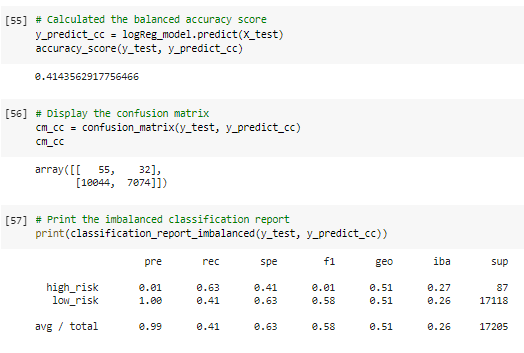

# Credit_Risk_Analysis

## Overview of Project

Use credit dataset from LendingClub to evaluate three machine learning models by using resampling to determine which is better at predicting credit risk

**Purpose:**
The purpose of this project is to determine if using the credit card credit dataset from LendingClub, a peer-to-peer lending services company, we’ll oversample the data using the RandomOverSampler and SMOTE algorithms, and undersample the data using the ClusterCentroids algorithm. Then, we’ll use a combinatorial approach of over- and undersampling using the SMOTEENN algorithm. Next, we’ll compare two new machine learning models that reduce bias, BalancedRandomForestClassifier and EasyEnsembleClassifier, to predict credit risk. 

**Task:** 
Employ different techniques to train and evaluate models with unbalanced classes. Evaluate the performance of these models and make a written recommendation on whether they should be used to predict credit risk.

**Approach:**

- *Use Resampling Models to Predict Credit Risk*
- *Use the SMOTEENN Algorithm to Predict Credit Risk*
- *Use Ensemble Classifiers to Predict Credit Risk*
- *A Written Report on the Credit Risk Analysis*

**Method:** Using scikit-learn and imbalanced-learn libraries, Google Collab.

## Resources
- Data Source: [LoanStats_2019Q1.csv](LoanStats_2019Q1.csv); 
- Source Code: 
    [credit_risk_resampling.ipynb](credit_risk_resampling.ipynb); [credit_risk_ensemble.ipynb](credit_risk_ensemble.ipynb);
  
- Programming Languages: Python
- Software/Tools: Google Collab, VS Code

## Results
Describe the balanced accuracy score and the precision and recall scores of all six machine learning models. 

**Random Oversampling**

**SMOTE Oversampling**

**ClusterCentroids Resampler**

**SMOTEENN**

**Balanced Random Forest Classifier**

**Easy Ensemble AdaBoost Classifier**

## Summary
 